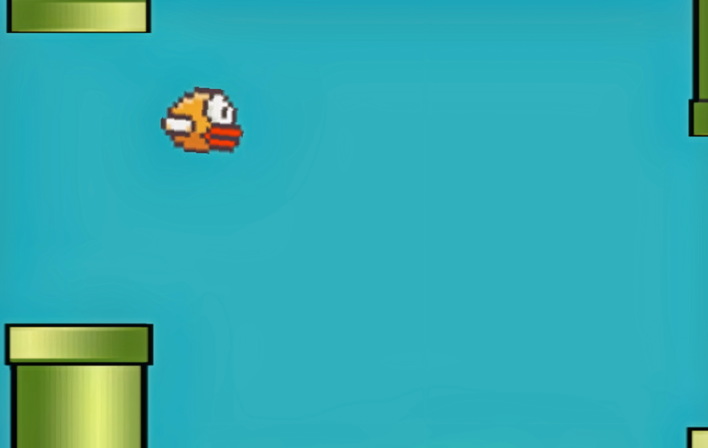

# Flappy Bird Redesign: A Cleaner and More Organized Version of the Classic Game

#### **Welcome to Flappy Bird Redesign! This is my fresh take on the classic Flappy Bird game that I built about two years ago. This project focuses on enhancing the code structure and organization to make it cleaner and easier to work with.**

**Key Features:**
- **Code Refactoring**: The codebase has undergone significant improvements, resulting in a more organized and readable structure. It's all about making the code neater and easier to understand.
- **Enhanced Organization**: I've restructured different components of the game using good practices to improve modularity and maintainability. It makes future modifications and additions more straightforward.
- **Improved Documentation**: Each method and functionality are now well-documented, providing clear explanations and instructions. It's designed to make it easier for developers to navigate and contribute to the project.
- **Same Addictive Gameplay**: While the focus was on code structure, the gameplay retains the addictive nature of the original Flappy Bird. You can still enjoy guiding the bird through obstacles and aiming for high scores.

Flappy Bird Redesign is a revamped version of the game I created about two years ago. It's not a major overhaul of the gameplay, but rather a dedicated effort to enhance the code structure and organization. Explore the code, have fun playing the game, and feel free to contribute if you'd like to help make it better. I'm still learning and would love to hear your suggestions.

### Instructions
1. **Installation**: Clone the repository to your local machine using the following command: `git clone https://github.com/dhyan-s/flappy-bird-redesign`
2. **Dependencies**: Navigate to the project directory and install the required dependencies using: `pip install -r requirements.txt`
3. **Run the Game**: Execute `python flappy_bird.py` in the project root to run the game.
4. **Gameplay**: Use the spacebar or mouse click to control the bird's flight. The objective is to navigate the bird through the openings between the pipes without colliding. Each successful passage earns you a point. The game ends if the bird collides with a pipe or the ground.
5. **Enjoy and Contribute**: Play the game, explore the codebase, and feel free to contribute to the project by following the guidelines outlined in the "Contributing" section.

Thank you for checking out Flappy Bird Redesign, and I appreciate your support!

